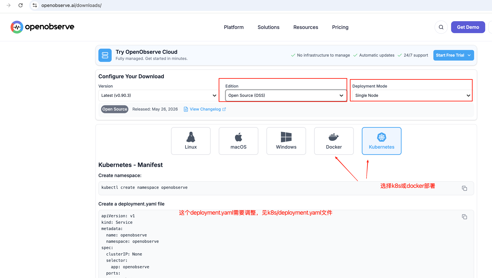
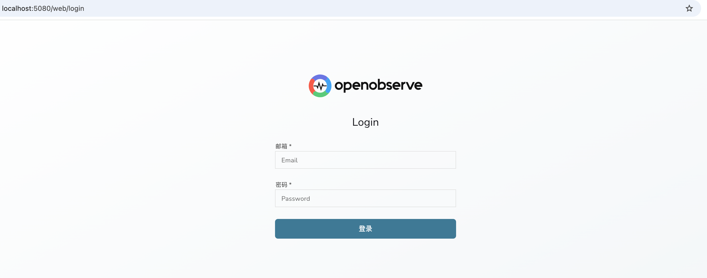

# openobserve notes
  Observability Construction Notes
# arch
见: [openobserve-arch.md](openobserve-arch.md)

# openobserve
https://openobserve.ai/downloads/
推荐k8s或docker部署


# 线上或测试环境部署
```shell
# 创建命名空间
kubectl create ns openobserve

# 创建secret
export ZO_ROOT_USER_EMAIL="root@example.com"
export ZO_ROOT_USER_PASSWORD="Complexpass#123"

# 这一步一般会提前创建好，或者使用nacos管理配置
kubectl create secret generic openobserve-auth \
    --namespace openobserve \
    --from-literal=email=${ZO_ROOT_USER_EMAIL} \
    --from-literal=password=${ZO_ROOT_USER_PASSWORD}

# 根据实际情况创建pv和pvc
# 如果使用aws云，需要创建gp3 sc
#kubectl apply -f k8s/aws-gp3-sc.yaml

# 云服务器部署
kubectl apply -f k8s/deployment.yaml

# 本地部署
#kubectl apply -f k8s/deployment-local.yaml

# 验证openobserve运行状态
kubectl get pvc -n openobserve
kubectl get pod -n openobserve

# 查看日志
kubectl logs -n openobserve openobserve-0

# 本地转发5080端口，注意Docker Desktop	不会自动分配，需要 port-forward
kubectl port-forward -n openobserve svc/openobserve 5080:5080
# 访问 http://localhost:5080

# 或者本地使用server nodeport模式转发
#kubectl apply -f k8s/server-nodeport.yaml
# 本地调试 kubectl port-forward -n openobserve pod/openobserve-0 30080:5080
#curl http://<<节点IP>:30080

# 根据实际情况部署ingress以及域名解析即可，这里省略
```
- 本地部署成功后，forward转发访问地址：http://localhost:5080
  
- 如果使用server-nodeport模式，访问地址：http://localhost:30080

# 查看状态
```shell
kubectl get svc -n openobserve
kubectl get pod -n openobserve
```

# 云平台更新pvc
```shell
kubectl get pvc -n openobserve
kubectl delete pvc data-openobserve-0 -n openobserve

# 修改资源限制
kubectl patch statefulset openobserve -n openobserve -p \
  '{"spec":{"template":{"spec":{"containers":[{"name":"openobserve","resources":{"limits":{"cpu":"4","memory":"4Gi"}}}]}}}}'
```

# 查看错误
```shell
# 查看 Pod 状态和事件
kubectl describe pod openobserve-0 -n openobserve
```

# 彻底清理并部署
```shell
# 1. 彻底清理旧资源
kubectl delete statefulset openobserve -n openobserve --ignore-not-found=true
kubectl delete pvc data-openobserve-0 -n openobserve --ignore-not-found=true
kubectl delete pv pv-openobserve-0 --ignore-not-found=true
kubectl get pvc -n openobserve

kubectl get sc gp3

# 2. 应用新配置
kubectl apply -f k8s/deployment.yaml

# 3. 查看状态
kubectl get pvc,pod -n openobserve

# 4. 查看日志
kubectl logs -n openobserve openobserve-0 --tail=50
```

# 非mac系统本地部署（以ubuntu为例子）
```shell
# 0.创建命名空间
kubectl create ns openobserve

# 创建secret
export ZO_ROOT_USER_EMAIL="root@example.com"
export ZO_ROOT_USER_PASSWORD="Complexpass#123"

# 这一步一般会提前创建好，或者使用nacos管理配置
kubectl create secret generic openobserve-auth \
    --namespace openobserve \
    --from-literal=email=${ZO_ROOT_USER_EMAIL} \
    --from-literal=password=${ZO_ROOT_USER_PASSWORD}

# 根据实际情况创建pv和pvc
# 1.手动创建 PV
kubectl apply -f k8s/ubuntu-pv.yaml

# 2.创建 PVC（会自动绑定到上面的 PV）
kubectl apply -f k8s/pvc.yaml

# 3.验证绑定
kubectl get pv,pvc -n openobserve

# 4.部署
# 去掉 securityContext 优先解决权限问题
kubectl apply -f k8s/deployment-local.yaml

# 查看状态
kubectl get pvc,pod -n openobserve

# 查看日志
kubectl logs -n openobserve openobserve-0

# 通过 port-forward 本地转发5080端口
kubectl port-forward -n openobserve svc/openobserve 5080:5080
# 访问 http://localhost:5080
```

# mac k8s 本地创建pvc和部署openobserve
```shell
# 0.创建命名空间
kubectl create ns openobserve

# 创建secret
export ZO_ROOT_USER_EMAIL="root@example.com"
export ZO_ROOT_USER_PASSWORD="Complexpass#123"

# 这一步一般会提前创建好，或者使用nacos管理配置
kubectl create secret generic openobserve-auth \
    --namespace openobserve \
    --from-literal=email=${ZO_ROOT_USER_EMAIL} \
    --from-literal=password=${ZO_ROOT_USER_PASSWORD}

# 1.手动创建 PV
kubectl apply -f k8s/mac-local-pv.yaml

# 2.创建 PVC（会自动绑定到上面的 PV）
kubectl apply -f k8s/pvc.yaml

# 3.验证绑定
kubectl get pv,pvc -n openobserve

# 4.部署
# Docker Desktop 去掉 securityContext 优先解决权限问题
kubectl apply -f k8s/deployment-local.yaml

# 查看状态
kubectl get pvc,pod -n openobserve

# 查看日志
kubectl logs -n openobserve openobserve-0

# 本地转发5080端口，注意Docker Desktop	不会自动分配，需要 port-forward
kubectl port-forward -n openobserve svc/openobserve 5080:5080
# 访问 http://localhost:5080
```

# 查看k8s secret
```shell
kubectl describe secret openobserve-auth -n openobserve
kubectl get secret openobserve-auth -n openobserve -o jsonpath='{.data}'
kubectl get secret openobserve-auth -n openobserve -o jsonpath='{.data.email}' | base64 --decode
kubectl get secret openobserve-auth -n openobserve -o jsonpath='{.data.password}' | base64 --decode
```

# k8s文档
https://kubernetes.io/zh-cn/docs/tasks/configmap-secret/managing-secret-using-kubectl/
